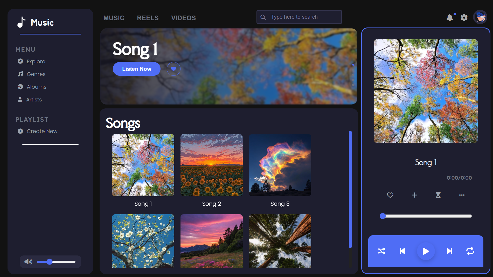

# Music Player

## Project Preview



## Description

This project is a **Music Player Web Application** built using **HTML5, CSS, and JavaScript**.
It allows users to play and control music directly in the browser with common playback features such as play, pause, skip, shuffle, loop, and volume adjustment.

The goal of this project is to practice **core frontend development concepts** like DOM manipulation, event handling, and media control using the HTML5 audio API.

---

## Features

* Play and pause songs
* Next and previous track controls
* Shuffle songs
* Loop current track
* Seek through the song using a progress bar
* Volume adjustment
* Song banner / cover display
* Like and unlike songs

---

## Project Structure

```
Music-Player/
│
├── assets/
│   ├── images/
│   │   └── song-banners
│   │
│   └── songs/
│
├── style.css
│ 
├── script.js
│
├── index.html
├── screenshot.png
└── README.md
```

---

## Getting Started

### 1. Clone the repository

```
git clone https://github.com/yourusername/music-player.git
```

### 2. Open the project

Navigate to the project folder and open **index.html** in your browser.

Example:

```
cd music-player
```

Then double-click **index.html** or open it with **Live Server** if using a code editor.

---

## Project Preview


---

## Future Improvements

* Sleep timer
* Song queue system
* Create and manage playlists
* Search songs functionality
* Local storage for liked songs
